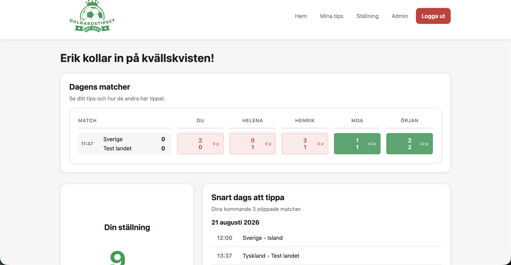
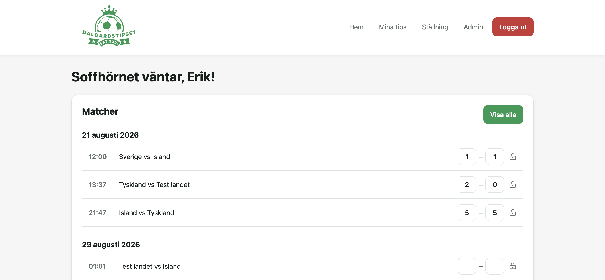
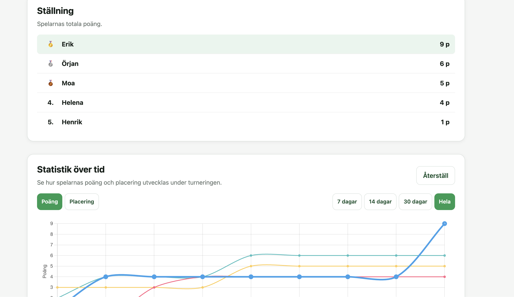

# Dalgardstipset

A small football tournament tipping site made for me, my family and friends.

Players can predict match results, answer tournament questions and compete on a shared leaderboard. The project is public so feel free to fork it and adapt it for your own tournament.

> **Note:** This is a hobby project that was built fairly quickly. The code works, but it is definitely not polished. The rushed development is probably visible in some of the questionable code, shortcuts, and commit messages. The CSS in particular contains some legacy styles and has not been cleaned. Use at your own risk.


## Screenshots

### Dashboard


### My predictions


### Standings


## Live site

https://dalgardstipset.pages.dev/

## Tech

* Vanilla HTML, CSS & JavaScript
* Cloudflare Pages & Pages Functions
* Cloudflare D1 (SQLite)
* Wrangler
* GitHub for version control and automatic deployment

## Features

### Players

* Dashboard with today's matches, points and leaderboard position
* Predict match results
* Answer tournament-wide questions
* See other players' predictions after the prediction deadline
* View leaderboard and statistics over time
* View prediction history

Match predictions are locked **1 hour before kickoff**.

Tournament questions are locked when the tournament starts.

### Admin

Admins can manage:

* Users and admin permissions
* Tournaments
* Tournament participants
* Teams and groups
* Matches and match results
* Prediction questions and answers
* Point rules


## Project structure

```text
database/
├── schema.sql
└── seed.sql

functions/
├── api/
│   ├── admin/
│   ├── auth/
│   └── user/
└── utils/

public/
├── js/
├── admin.html
├── index.html
├── login.html
├── mina-tips.html
├── stallning.html
└── style.css

API.md
package.json
wrangler.toml
```

The API is handled by Cloudflare Pages Functions. The folder structure maps directly to routes such as `/api/auth/login`, `/api/user/matches` and `/api/admin/users`.

## API

The API is split into:

```text
/api/auth/
/api/user/
/api/admin/
```

See [`API.md`](API.md) for the current API documentation.

> `API.md` is basically up to date with all routes, but don't treat it as the absolute source of truth.


## Local development

Install dependencies:

```bash
npm install
```

Initialize the local D1 database:

```bash
npx wrangler d1 execute dalgardstipset-db --local --file=database/schema.sql
```

For demo data:

```bash
npx wrangler d1 execute dalgardstipset-db --local --file=database/seed.sql
```

Start the site:

```bash
npx wrangler pages dev
```

That's basically it.

The seed data includes a demo tournament and an admin account:

**Username:** `test`
**Password:** `test`

Log in and play around with the admin interface. You can create tournaments, teams, matches, prediction questions and scoring rules yourself.
.

## Security

Passwords are hashed using PBKDF2/SHA-256 and the application uses session-based authentication with HttpOnly cookies.

That said, this is a private hobby project and has **not** been security checked. There are no guarantees, so don't use it for anything important without reviewing the code yourself.

